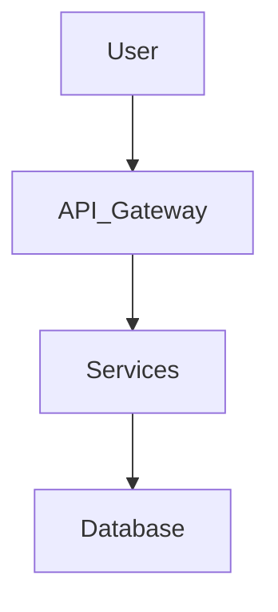

# 🧠 FAANG System Design Simulator

AI-powered system design interview simulator that generates scalable architectures, evaluates them like a FAANG interviewer, detects bottlenecks, visualizes distributed systems, and simulates real interview follow-ups.

Built for practicing production-scale distributed systems interviews.

---

## 🚀 Features

### 🏗 AI Architecture Generation

Generate scalable system designs for prompts like:

- Design Instagram
- Design Uber
- Design YouTube
- Design WhatsApp
- Design a URL Shortener

Outputs include:

- Microservices
- APIs
- Databases
- Caching layers
- Load balancing
- Scaling strategies
- Distributed architecture diagrams

---

### 📊 FAANG-Style Evaluation

Every architecture is reviewed using a structured interview rubric.

Scoring includes:

- Scalability
- Clarity
- Completeness
- Engineering tradeoffs

Also generates:

- Strengths
- Weaknesses
- Bottlenecks
- Hiring recommendation
- Engineering feedback

---

### ⚠ Automatic Bottleneck Detection

Detects issues such as:

- Missing cache layer
- No CDN
- Database bottlenecks
- Missing replication
- Single points of failure
- Poor load balancing

---

### 📈 System Diagram Visualization

Architectures are rendered using Mermaid.js diagrams.

Example:



---

### 🎤 Interviewer Mode

Simulates real FAANG follow-up questioning.

Generates:

- Follow-up design questions
- Scalability pressure scenarios
- Tradeoff discussions
- Debugging situations

---

## 🖥 Tech Stack

### Frontend
- React
- Axios
- Mermaid.js

### Backend
- FastAPI
- Python
- OpenAI API

### Concepts
- Distributed Systems
- System Design
- Scalability Engineering
- Microservices Architecture

---

## 📸 Example

### Input

```txt
Design Instagram backend
```

### Output

- Microservices architecture
- Feed generation system
- Redis caching
- CDN layer
- Database sharding
- Load balancing
- Mermaid system diagram
- FAANG interview evaluation
- Bottleneck analysis
- Interview follow-up questions

---

## ⚡ Local Setup

### 1. Clone Repository

```bash
git clone <your-repo-url>
cd system-design-simulator
```

---

### 2. Backend Setup

```bash
cd backend

pip install -r requirements.txt

uvicorn main:app --reload
```

Backend:

```txt
http://127.0.0.1:8000
```

Swagger Docs:

```txt
http://127.0.0.1:8000/docs
```

---

### 3. Frontend Setup

```bash
cd frontend

npm install

npm start
```

Frontend:

```txt
http://localhost:3000
```

---

## 🔑 Environment Variables

Create a `.env` file inside `/backend`

```env
OPENAI_API_KEY=your_api_key_here
```

---

## 🧠 Why This Project Stands Out

Most interview prep tools only generate answers.

This platform:
- evaluates architecture quality
- simulates interviewer pressure
- detects engineering flaws
- visualizes distributed systems
- mimics real FAANG interview flow

Combines:
- AI
- distributed systems
- full-stack engineering
- scalable architecture reasoning
- interview simulation

into one platform.

---

## 🔥 Future Improvements

- Timed interview rounds
- Voice interviewer mode
- Company-specific interviewer personas
- Collaborative mock interviews
- Architecture editing canvas
- Kubernetes deployment simulation
- Persistent scoring history
